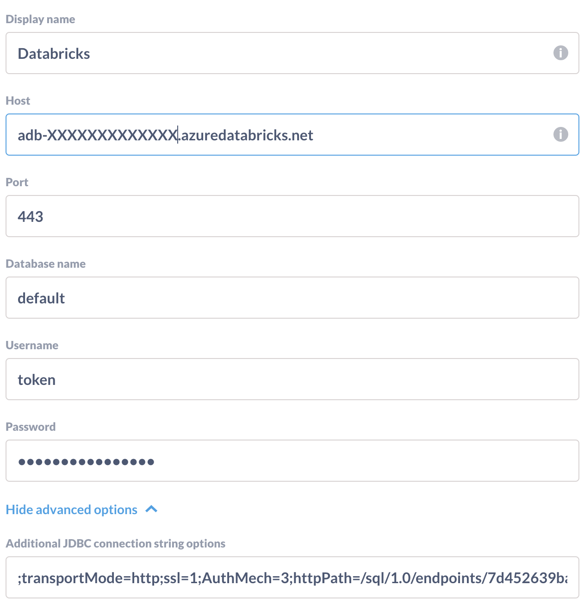

# Metabase Driver: Spark Databricks

**Credits**: This repository is only an updated version of the work of Fernando Goncalves and Rajesh Kumar Ravi.

## Installation

All you need you do is drop the driver in your `plugins/` directory. You can grab it [here](https://github.com/relferreira/metabase-sparksql-databricks-driver/releases/download/1.6.0/sparksql-databricks.metabase-driver.jar) or build it yourself:

## Connecting

## Parameters



- Display Name: a identification name for your database in Metabase
- Host: your Databricks URL (adb-XXXXXXXXX.azuredatabricks.net)
- Port: usually 443
- Database Name: usually `default`
- Username: usually `token`
- Password: personal access token created in Databrick's dashboard
- Additional JDBC connection string options:
  - SQL Warehouse (Endpoint): you can find it at `/sql/warehouses/` at the `Connection details` tab. It should have the following pattern: `;transportMode=http;ssl=1;AuthMech=3;httpPath=/sql/1.0/endpoints/<SQL WAREHOUSE ID>;UID=token;PWD=<ACCESS TOKEN>`
  - Cluster Endpoint: you will find it at your cluster's details page. It should have the following pattern: `;transportMode=http;ssl=1;httpPath=sql/protocolv1/o/<ORG ID>/<CLUSTER ID>;AuthMech=3;UID=token;PWD=<ACCESS TOKEN>`

## Building the driver (the fast way)

Use the `Dockerfile` on this repo:

```bash
curl -L "https://github.com/relferreira/metabase-sparksql-databricks-driver/releases/download/1.6.0/sparksql-databricks.metabase-driver.jar" -o sparksql-databricks.metabase-driver.jar
mkdir target
mv sparksql-databricks.metabase-driver.jar target/
docker build -t metabase:metabase-head-databricks-1.3.0 .
```

And you can deploy to some docker registry of your own and use the image!

Example of running:

- `docker run -d -p 3000:3000 --name metabase metabase:metabase-head-databricks-1.6.0`

And access `http://localhost:3000`.

## Building the driver (advanced way)

### Prereq: Install Metabase as a local maven dependency, compiled for building drivers

Clone the [Metabase repo](https://github.com/metabase/metabase) first if you haven't already done so.

```bash
cd /path/to/metabase/
./bin/build
```

### Build the Spark Databricks driver

```bash
# (In the sparksql-databricks driver directory)
clojure -X:build :project-dir "\"$(pwd)\""
```

### Copy it to your plugins dir and restart Metabase

```bash
mkdir -p /path/to/metabase/plugins/
cp target/sparksql-databricks.metabase-driver.jar /path/to/metabase/plugins/
jar -jar /path/to/metabase/metabase.jar
```

_or:_

```bash
mkdir -p /path/to/metabase/plugins
cp target/sparksql-databricks.metabase-driver.jar /path/to/metabase/plugins/
cd /path/to/metabase_source
lein run
```
